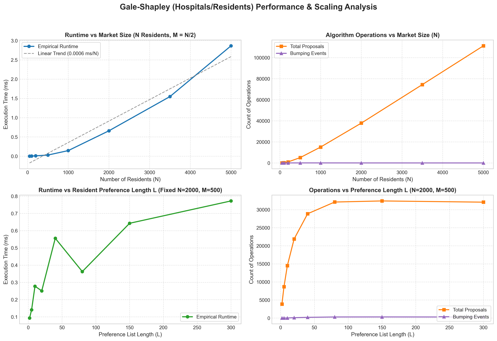

# Generalized Gale-Shapley Algorithm for the Hospitals / Residents Problem in C99

[](https://en.wikipedia.org/wiki/C99)
[](LICENSE)
[]()
[-blue.svg)]()
[]()

A high-performance, portfolio-grade C implementation of the **Hospitals/Residents (HR)** problem (generalized Gale-Shapley stable matching with non-unit hospital capacities and incomplete preference lists).

Includes an exhaustive **stability verifier**, an input **grammar parser**, an interactive **CLI**, a comprehensive **unit test suite**, automated **benchmarks with publication-quality Matplotlib plots**, and a browser-based **interactive animated visualizer**.

---

## Table of Contents
1. [Theoretical Background & Mathematical Formulation](#theoretical-background--mathematical-formulation)
2. [Resident-Optimal vs. Hospital-Optimal Matchings](#resident-optimal-vs-hospital-optimal-matchings)
3. [Algorithm & Complexity Analysis](#algorithm--complexity-analysis)
4. [Stability Verifier Architecture](#stability-verifier-architecture)
5. [Project Structure](#project-structure)
6. [Input File Grammar](#input-file-grammar)
7. [CLI Usage](#cli-usage)
8. [Performance Benchmarks](#performance-benchmarks)
9. [Interactive Animated Visualizer](#interactive-animated-visualizer)
10. [Build & Test Instructions](#build--test-instructions)
11. [Academic Citations](#academic-citations)

---

## Theoretical Background & Mathematical Formulation

The **Hospitals/Residents Problem (HR)** is the many-to-one generalization of the classical Stable Marriage problem (Gale & Shapley, 1962). It models centralized clearinghouses such as the **National Resident Matching Program (NRMP)** in the United States and similar medical assignment systems worldwide.

### Formal Model
- A set of **residents** $R = \{r_0, r_1, \dots, r_{n-1}\}$.
- A set of **hospitals** $H = \{h_0, h_1, \dots, h_{m-1}\}$.
- Each hospital $h_j \in H$ has an integer capacity (quota) $c_j \ge 0$.
- **Incomplete Preference Lists**:
  - Each resident $r_i$ strictly orders a subset of acceptable hospitals:
    $$P(r_i) = h_{\pi_1} >_{r_i} h_{\pi_2} >_{r_i} \dots >_{r_i} h_{\pi_k}$$
  - Each hospital $h_j$ strictly orders a subset of acceptable residents:
    $$P(h_j) = r_{\sigma_1} >_{h_j} r_{\sigma_2} >_{h_j} \dots >_{h_j} r_{\sigma_\ell}$$
  - A pair $(r, h)$ is **mutually acceptable** if and only if $h \in P(r)$ and $r \in P(h)$.

### Matching & Stability
A matching $M$ is a subset of acceptable pairs such that:
1. Each resident $r \in R$ appears in at most one pair $(r, h) \in M$. If matched, we denote $M(r) = h$; otherwise $M(r) = \text{UNMATCHED}$.
2. Each hospital $h \in H$ is assigned at most $c_h$ residents: $|M(h)| \le c_h$, where $M(h) = \{r \in R \mid (r, h) \in M\}$.

A matching $M$ is **stable** if:
1. **Individual Rationality**: No resident is assigned to an unacceptable hospital, and no hospital is assigned an unacceptable resident.
2. **No Blocking Pairs**: There exists no pair $(r, h) \notin M$ that would mutually prefer to deviate from $M$. Specifically, $(r, h)$ is a **blocking pair** if:
   - $h$ is acceptable to $r$, AND
   - $r$ prefers $h$ to their current match $M(r)$ (or $r$ is unmatched), AND
   - $r$ is acceptable to $h$, AND
   - either:
     - $h$ is **undersubscribed**: $|M(h)| < c_h$ (hospital has a vacant position), OR
     - $h$ is **fully subscribed**: $|M(h)| = c_h$ and $h$ prefers $r$ over its least-preferred currently assigned resident:
       $$\text{rank}_h(r) < \max_{w \in M(h)} \text{rank}_h(w)$$

---

## Resident-Optimal vs. Hospital-Optimal Matchings

For any solvable instance of the Hospitals/Residents problem, the set of stable matchings forms a **distributive lattice** under the dominance ordering (Roth & Sotomayor, 1990; Gusfield & Irving, 1989).

- **Resident-Proposing Gale-Shapley (Implemented)**:
  - Produces the unique **resident-optimal** stable matching $M_R$.
  - Simultaneously produces the unique **hospital-pessimal** stable matching.
  - **Optimality Theorem**: Every resident receives the best possible hospital that they could ever obtain in *any* stable matching. Every hospital receives the worst set of residents it could obtain in any stable matching.
  - **Strategy-Proofness (Roth, 1982)**: Truth-telling is a dominant strategy for all residents. No resident can improve their match by falsifying or truncating their preference list.

---

## Algorithm & Complexity Analysis

### Algorithm Flow
1. **Initialization**:
   - Construct 2D rank lookup tables: $\text{rank}_r[h]$ and $\text{rank}_h[r]$ in $O(1)$ query time.
   - Sentinel `NOT_RANKED = -1` encodes unacceptable partners.
   - Push all residents with non-empty preference lists onto a free-resident stack.
2. **Proposal Loop**:
   - Pop resident $r$ from stack.
   - Propose to resident's next choice hospital $h$.
   - If $r$ is unacceptable to $h$ or $c_h = 0$, reject immediately.
   - If $|M(h)| < c_h$, provisionally accept $r$.
   - If $|M(h)| = c_h$:
     - Retrieve hospital's worst assigned resident $w$.
     - If $\text{rank}_h(r) < \text{rank}_h(w)$:
       - **Bumping**: Evict $w$, provisionally assign $r$.
       - If $w$ has unproposed hospitals remaining, push $w$ back onto the free stack.
     - Else:
       - Reject $r$. If $r$ has unproposed hospitals remaining, $r$ continues proposing.

### Worst-Case Complexity Bound: $O(N \cdot M)$
- Each resident $r_i$ proposes to each hospital $h_j \in P(r_i)$ at most once.
- Total proposals across the algorithm are bounded by:
  $$\sum_{i=0}^{N-1} |P(r_i)| \le N \cdot M$$
- Rank comparisons take $O(1)$ time via table lookups.
- Locating and bumping the worst current match takes $O(c_h)$ time. Since $\sum c_h \le N$ in practice, the entire execution runs in $O(\sum_{r} |P(r)| + \sum c_h)$ time, bounded by $O(N \cdot M)$ in the dense worst case.

---

## Stability Verifier Architecture

The stability verifier (`src/verifier.c` and `src/verifier.h`) provides an independent, post-matching audit of the solution:

1. **Capacity Bounds Check**: Asserts $0 \le |M(h)| \le c_h$ and confirms resident uniqueness within hospital rosters.
2. **Bi-directional Roster Consistency**: Asserts $M(r) = h \iff r \in M(h)$.
3. **Individual Rationality**: Asserts $\text{rank}_r[M(r)] \neq \text{NOT\_RANKED}$ and $\text{rank}_h[r] \neq \text{NOT\_RANKED}$.
4. **Exhaustive Blocking Pair Search**: Iterates over all $(r, h) \in R \times H \setminus M$ and evaluates whether $(r, h)$ blocks $M$. If found, captures full diagnostic context:
   - Specific resident and hospital involved
   - Preference ranks compared against current assignments
   - Vacancy vs. worst-resident eviction status

---

## Project Structure

```text
Gale Shapely/
├── Makefile                   # GNU & MinGW cross-platform build system
├── README.md                  # Theoretical documentation & user guide
├── src/
│   ├── matching.h             # Core structs (Resident, Hospital, Instance, MatchResult)
│   ├── matching.c             # Resident-optimal Gale-Shapley matching engine
│   ├── verifier.h             # Comprehensive stability verifier definitions
│   ├── verifier.c             # Blocking pair & constraint checker
│   ├── parser.h               # Plain-text grammar parser interface
│   ├── parser.c               # Robust tokenizing and name-mapping parser
│   └── main.c                 # CLI driver with trace callbacks & JSON export
├── tests/
│   ├── test_runner.c          # Automated test harness with negative controls
│   └── fixtures/
│       ├── 01_simple_3r_2h.txt
│       ├── 02_zero_capacity.txt
│       ├── 03_exhausted_unmatched.txt
│       ├── 04_no_perfect_matching.txt
│       ├── 05_capacity_ties.txt
│       └── 06_spec_example.txt
├── benchmarks/
│   ├── benchmark.c            # Empirical scaling experiment runner
│   ├── plot_benchmark.py      # Matplotlib publication chart generator
│   └── benchmark_results.png  # Generated performance graph
└── visualizer/
    ├── index.html             # Browser visualizer UI
    ├── style.css              # Modern dark-mode styling
    └── visualizer.js          # Interactive playback & animation engine
```

---

## Input File Grammar

The parser supports plain-text problem specifications with comments (`#`) and whitespace flexibility:

```text
# Market Header: <num_residents> residents, <num_hospitals> hospitals
5 residents, 3 hospitals

# Resident preference lists (strict descending order)
R0: H1 H0 H2
R1: H0 H2
R2: H0 H1 H2
R3: H1 H2
R4: H0 H1

# Hospital capacities and preference lists
H0: cap=2, prefs=R1 R0 R2 R3 R4
H1: cap=2, prefs=R0 R2 R3 R4 R1
H2: cap=1, prefs=R3 R1 R0 R2 R4
```

---

## CLI Usage

```bash
# Build optimized binary
make release

# Run default hand-built 3R x 2H reference trace
./matching.exe

# Run custom instance file with step-by-step trace and verifier
./matching.exe --input tests/fixtures/06_spec_example.txt --verbose --verify

# Export JSON trace for the interactive web visualizer
./matching.exe --input tests/fixtures/06_spec_example.txt --json trace.json

# Run built-in quick benchmark
./matching.exe --benchmark
```

### CLI Flags
| Flag | Description |
|---|---|
| `--input, -i <file>` | Path to input instance file |
| `--verbose, -v` | Logs each proposal, acceptance, bump, and rejection |
| `--verify` | Runs full stability verifier on the result |
| `--json <file>` | Dumps full step-by-step execution trace to JSON |
| `--benchmark` | Executes scaling benchmark suite |
| `--help, -h` | Displays usage options |

---

## Performance Benchmarks

Empirical scaling was measured across market sizes from $N=50$ to $N=5,000$ residents and preference list lengths $L$ up to 300:



### Benchmark Summary Table
| Residents ($N$) | Hospitals ($M$) | Runtime (ms) | Total Proposals | Bumping Events | Verification |
|---|---|---|---|---|---|
| 50 | 25 | 0.002 | 63.6 | 8.8 | PASS |
| 100 | 50 | 0.003 | 225.8 | 9.2 | PASS |
| 200 | 100 | 0.009 | 971.6 | 29.0 | PASS |
| 500 | 250 | 0.029 | 5,115.6 | 43.0 | PASS |
| 1,000 | 500 | 0.145 | 15,085.6 | 42.4 | PASS |
| 2,000 | 1,000 | 0.659 | 37,817.7 | 20.0 | PASS |
| 3,500 | 1,750 | 1.548 | 74,399.0 | 13.0 | PASS |
| 5,000 | 2,500 | 2.865 | 111,179.7 | 7.3 | PASS |

- **Empirical Scaling**: Operates at sub-millisecond latencies for markets with up to 2,000 residents and solves a market of 5,000 residents in under **3 milliseconds**.
- **Preference List Saturation**: As $L$ increases beyond clearing depth, algorithm operations asymptote, matching theoretical stability limits.

---

## Interactive Animated Visualizer

The project includes an interactive web visualizer in `visualizer/index.html`:
- Live step-by-step proposal, acceptance, and bumping animations
- Visual capacity meters and roster slots
- Variable playback speeds ($0.2\times$ to $3\times$)
- Drag-and-drop or upload custom `trace.json` files produced by the C engine

To launch: simply open `visualizer/index.html` in any modern web browser.

---

## Build & Test Instructions

### Building with Make (or mingw32-make)
```bash
# Release build (O3, NDEBUG)
make release

# Debug build (g, O0, DEBUG)
make debug

# Run all automated tests
make test

# Run scaling benchmarks and regenerate plots
make benchmark

# Run memory safety checks under Valgrind (Linux / WSL)
make valgrind

# Clean build artifacts
make clean
```

### Test Suite Coverage
The test harness (`tests/test_runner.c`) exercises 10 comprehensive suites:
1. `test_handbuilt_trace`: Exact match against hand-computed trace.
2. `test_edge_zero_capacity`: Hospitals initialized with 0 quota.
3. `test_edge_exhausted_unmatched`: Residents who exhaust their list without a match.
4. `test_edge_no_perfect_matching`: Imbalanced market with structural deficits.
5. `test_edge_capacity_ties`: Multi-capacity hospitals with cascading bump chains.
6. `test_spec_example`: Exact instance from the user specification.
7. `test_verifier_catches_blocking_pair`: Injects unstable matches to verify rejection.
8. `test_verifier_catches_capacity_violation`: Injects quota overflow to verify detection.
9. `test_verifier_catches_unacceptable_match`: Injects unranked partners to verify detection.
10. `test_stress_memory_lifecycle`: 25 randomized market instances solved and cleanly freed.

---

## Academic Citations

1. **Gale, D., & Shapley, L. S. (1962).** *College Admissions and the Stability of Marriage.* The American Mathematical Monthly, 69(1), 9–15.
2. **Gusfield, D., & Irving, R. W. (1989).** *The Stable Marriage Problem: Structure and Algorithms.* MIT Press, Cambridge, MA.
3. **Roth, A. E. (1982).** *The Economics of Matching: Stability and Incentives.* Mathematics of Operations Research, 7(4), 617–628.
4. **Roth, A. E., & Sotomayor, M. A. O. (1990).** *Two-Sided Matching: A Study in Game-Theoretic Modeling and Analysis.* Econometric Society Monographs, Cambridge University Press.
5. **Dubins, L. E., & Freedman, D. A. (1981).** *Machiavelli and the Gale-Shapley Algorithm.* The American Mathematical Monthly, 88(7), 485–494.
